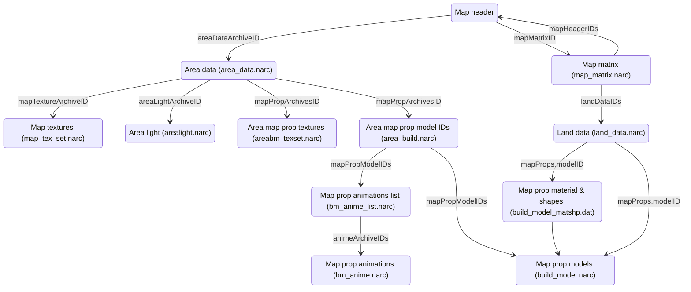

# Map file format specifications

The following sections describe the various file formats encountered in the files
containing map data.

Values and offsets described in this document are those found in the vanilla ROM
of Pokémon Platinum.

Here's a graph representing the different files and how they point to data in
other files:



As you can see, most of those files are NARC files.

> [!NOTE]
> As per the NARC specification, the size of each file contained inside one of
> those archives must be a multiple of 4 bytes. If this is not the case, the
> file is padded with `0xFF` bytes at the end to reach this.

The following types are considered well-known and used throughout this document:

- `u8`/`u16`/`u32`: unsigned 8/16/32-bit integers.
- `bool`: unsigned 8-bit integer, where 0 is `false` and 1 is `true`.
- `char`: unsigned 8-bit integer representing a character.
- `fx16`: signed 16-bit fixed-point number, with 1 bit for the sign, 3 bits for
  the integer part, and 12 bits for the fractional part (1.3.12).
- `fx32`: signed 32-bit fixed-point number, with 1 bit for the sign, 19 bits
  for the integer part, and 12 bits for the fractional part (1.19.12).
- `VecFx32`: structure containing three `fx32` values, representing a 3D vector.

Moreover, for any type `T`, `T[]` represents an array of `T`. Any other type
should be documented in the context where it is used.

## Map headers

The map headers are not stored in a file on the ROM, but are instead stored in
a table inside the code binary. Because it is the starting point for loading a
map, it is nevertheless included in this list.

A map header is a structure that contains metadata about a map:

```c
struct MapHeader {
    u8 areaDataArchiveID;
    u8 unk_01;
    u16 mapMatrixID;
    u16 scriptsArchiveID;
    u16 initScriptsArchiveID;
    u16 msgArchiveID;
    u16 dayMusicID;
    u16 nightMusicID;
    u16 wildEncountersArchiveID;
    u16 eventsArchiveID;
    u16 mapLabelTextID : 8;
    u16 mapLabelWindowID : 8;
    u8 weather;
    u8 cameraType;
    u16 mapType : 7;
    u16 battleBG : 5;
    u16 isBikeAllowed : 1;
    u16 isRunningAllowed : 1;
    u16 isEscapeRopeAllowed : 1;
    u16 isFlyAllowed : 1;
};
```

## Map matrix (`map_matrix.narc`)

This NARC contains 289 files.

Here's the structure of each file:

| Name                     | Offset                                               | Size                                                              | Type     | Description                                                                                                                                                                                    |
| ------------------------ | ---------------------------------------------------- | ----------------------------------------------------------------- | -------- | ---------------------------------------------------------------------------------------------------------------------------------------------------------------------------------------------- |
| `height`                 | `0x0000`                                             | 1                                                                 | `u8`     | Height of the map matrix (how many maps are in the vertical direction).                                                                                                                        |
| `width`                  | `0x0001`                                             | 1                                                                 | `u8`     | Width of the map matrix (how many maps are in the horizontal direction).                                                                                                                       |
| `hasMapHeaderIDsSection` | `0x0002`                                             | 1                                                                 | `bool`   | Whether the map matrix contains the map header IDs section ("`mapHeadersIDs`").                                                                                                                |
| `hasAltitudesSection`    | `0x0003`                                             | 1                                                                 | `bool`   | Whether the map matrix contains the altitudes section ("`altitudes`").                                                                                                                         |
| `modelNamePrefixLen`     | `0x0004`                                             | 1                                                                 | `u8`     | Length of the model name prefix string ("`modelNamePrefix`")                                                                                                                                   |
| `modelNamePrefix`        | `0x0005`                                             | `modelNamePrefixLen`                                              | `char[]` | Prefix given to the map model names found in the NSBMD files.                                                                                                                                  |
| `mapHeaderIDs`           | `0x0006`                                             | 2 \* `height` \* `width` if `hasMapHeaderIDsSection == 1`, else 0 | `u16[]`  | 2D array of map header IDs. The IDs are stored in row-major order. Not present if `hasMapHeaderIDsSection` is set to `0`.                                                                      |
| `altitudes`              | `0x0006 + sizeof(mapHeadersIDs)`                     | `height` \* `width` if `hasAltitudesSection == 1`, else 0         | `u8[]`   | 2D array of altitudes. Used to calculate the Y-coordinate when rendering a map and its props. The altitudes are stored in row-major order. Not present if `hasAltitudesSection` is set to `0`. |
| `landDataIDs`            | `0x0006 + sizeof(mapHeadersIDs) + sizeof(altitudes)` | 2 \* `height` \* `width`                                          | `u16[]`  | 2D array of indexes in the `land_data.narc` NARC. The indexes are stored in row-major order.                                                                                                   |

> [!NOTE]
> The same index in `mapHeadersIDs`, `altitudes`, and `landDataIDs` refers to the same map.

## Land data (`land_data.narc`)

This NARC contains 666 files.

Here's the structure of each file:

| Name                    | Offset                                 | Size                                                 | Type               | Description                                                                                                                       |
| ----------------------- | -------------------------------------- | ---------------------------------------------------- | ------------------ | --------------------------------------------------------------------------------------------------------------------------------- |
| `terrainAttributesSize` | `0x0000`                               | 4                                                    | `u32`              | Size of the terrain attributes section ("`terrainAttributes`"). Always set to, and expected to be set to 2048.                    |
| `mapPropsSize`          | `0x0004`                               | 4                                                    | `u32`              | Size of the map props section ("`mapProps`").                                                                                     |
| `mapModelSize`          | `0x0008`                               | 4                                                    | `u32`              | Size of the map model section ("`mapModel`").                                                                                     |
| `bdhcSize`              | `0x000C`                               | 4                                                    | `u32`              | Size of the BDHC section ("`bdhc`").                                                                                              |
| `terrainAttributes`     | `0x0010`                               | `terrainAttributesSize` (Always 2048; 2 \* 32 \* 32) | `u16[]`            | 2D array (32x32) of terrain attributes, which contains tile collision and behavior. The attributes are stored in row-major order. |
| `mapProps`              | `0x0810`                               | `mapPropsSize`                                       | Struct `MapProp[]` | Array of map props placed on the map. There can be at most 32 map props per map.                                                  |
| `mapModel`              | `0x0810 + mapPropsSize`                | `mapModelSize`                                       | NSBMD              | The model file for the map.                                                                                                       |
| `bdhc`                  | `0x0810 + mapPropsSize + mapModelSize` | `bdhcSize`                                           | Struct `BDHC`      | BDHC data for the map.                                                                                                            |

### Struct `MapProp`

| Name       | Offset   | Size | Type      | Description                                                        |
| ---------- | -------- | ---- | --------- | ------------------------------------------------------------------ |
| `modelID`  | `0x0000` | 4    | `u32`     | Index of the associated model in the `build_model.narc` NARC.      |
| `position` | `0x0004` | 12   | `VecFx32` | Position of the map prop on the map.                               |
| `rotation` | `0x0010` | 12   | `VecFx32` | Rotation of the map prop, where each angle is between 0 and 65535. |
| `scale`    | `0x001C` | 12   | `VecFx32` | Scale of the map prop, where 1.0 is the original size.             |
| `dummy`    | `0x0028` | 8    | `u32[2]`  | Unknown: unused in the code, and seems to be always zero.          |

### Struct `BDHC`

| Name              | Offset                     | Size                   | Type                 | Description                                                                                                                                    |
| ----------------- | -------------------------- | ---------------------- | -------------------- | ---------------------------------------------------------------------------------------------------------------------------------------------- |
| `magic`           | `0x0000`                   | 4                      | `char[]`             | Magic number: always set to `BDHC`.                                                                                                            |
| `pointsCount`     | `0x0004`                   | 2                      | `u16`                | Number of elements in the points array ("`points`").                                                                                           |
| `normalsCount`    | `0x0006`                   | 2                      | `u16`                | Number of elements in the normal vectors array ("`normals`").                                                                                  |
| `constantsCount`  | `0x0008`                   | 2                      | `u16`                | Number of elements in the constants array ("`constants`").                                                                                     |
| `platesCount`     | `0x000A`                   | 2                      | `u16`                | Number of elements in the plates array ("`plates`").                                                                                           |
| `stripsCount`     | `0x000C`                   | 2                      | `u16`                | Number of elements in the strips array ("`strips`").                                                                                           |
| `accessListCount` | `0x000E`                   | 2                      | `u16`                | Number of elements in the access list array ("`accessList`").                                                                                  |
| `points`          | `0x0010`                   | 8 \* `pointsCount`     | Struct `BDHCPoint[]` | Array of 2D points.                                                                                                                            |
| `normals`         | `0x0010 + 8 * pointsCount` | 12 \* `normalsCount`   | `VecFx32[]`          | Array of normal vectors. They represent the unit normal vector of a BDHC plate (e.g., for a horizontal plate, the vector that points upwards). |
| `constants`       | `... + 12 * normalsCount`  | 4 \* `constantsCount`  | `fx32[]`             | Array of constants. They represent the distance from the origin to the plate.                                                                  |
| `plates`          | `... + 4 * constantsCount` | 8 \* `platesCount`     | Struct `BDHCPlate[]` | Array of plates.                                                                                                                               |
| `strips`          | `... + 8 * platesCount`    | 8 \* `stripsCount`     | Struct `BDHCStrip[]` | Array of horizontal strips, which are groups of plates.                                                                                        |
| `accessList`      | `... + 8 * stripsCount`    | 2 \* `accessListCount` | `u16[]`              | Array of indexes in the `plates` array.                                                                                                        |

> [!NOTE]
> The `strips` array is sorted by the `scanline` field in ascending order.
> This is a requirement by the game to be able to find the correct strip for a
> given map object position.

#### Struct `BDHCPoint`

| Name | Offset   | Size | Type   | Description                |
| ---- | -------- | ---- | ------ | -------------------------- |
| `x`  | `0x0000` | 4    | `fx32` | X-coordinate of the point. |
| `z`  | `0x0004` | 4    | `fx32` | Z-coordinate of the point. |

> [!NOTE]
> The BDHC subsystem uses its own 2D Cartesian coordinate system, where the origin
> is at the center of the map, the X axis points to the right, and the Z axis points
> downwards.
>
> The top-left corner of the map is at (-256, -256), and the bottom-right corner
> is at (256, 256).

#### Struct `BDHCPlate`

| Name               | Offset   | Size | Type  | Description                                                     |
| ------------------ | -------- | ---- | ----- | --------------------------------------------------------------- |
| `firstPointIndex`  | `0x0000` | 2    | `u16` | Index of the first (top-left) point in the `points` array.      |
| `secondPointIndex` | `0x0002` | 2    | `u16` | Index of the second (bottom-right) point in the `points` array. |
| `normalIndex`      | `0x0004` | 2    | `u16` | Index of the normal vector in the `normals` array.              |
| `constantIndex`    | `0x0006` | 2    | `u16` | Index of the constant in the `constants` array.                 |

#### Struct `BDHCStrip`

| Name                     | Offset   | Size | Type   | Description                                                                                          |
| ------------------------ | -------- | ---- | ------ | ---------------------------------------------------------------------------------------------------- |
| `scanline`               | `0x0000` | 4    | `fx32` | The Z-coordinate of the line that generates this strip, which is crossed by all plates in the strip. |
| `accessListElementCount` | `0x0004` | 2    | `u16`  | Number of elements in the access list for this strip.                                                |
| `accessListStartIndex`   | `0x0006` | 2    | `u16`  | Index of the first element in the access list for this strip.                                        |

## Area data (`area_data.narc`)

This NARC contains 75 files.

Here's the structure of each file:

| Name                  | Offset   | Size | Type  | Description                                                                            |
| --------------------- | -------- | ---- | ----- | -------------------------------------------------------------------------------------- |
| `mapPropArchivesID`   | `0x0000` | 2    | `u16` | Index of the associated files in the `area_build.narc` and `areabm_texset.narc` NARCs. |
| `mapTextureArchiveID` | `0x0002` | 2    | `u16` | Index of the associated file in the `map_tex_set.narc` NARC.                           |
| `dummy`               | `0x0004` | 2    | `u16` | Unknown: value changes in the NARC, but is unused in the code.                         |
| `areaLightArchiveID`  | `0x0006` | 2    | `u16` | Index of the associated file in the `arealight.narc` NARC.                             |

## Area map prop model IDs (`area_build.narc`)

This NARC contains 71 files.

Here's the structure of each file:

| Name                   | Offset   | Size                        | Type    | Description                                                                                                             |
| ---------------------- | -------- | --------------------------- | ------- | ----------------------------------------------------------------------------------------------------------------------- |
| `mapPropModelIDsCount` | `0x0000` | 2                           | `u16`   | Number of elements in the `mapPropModelIDs` array.                                                                      |
| `mapPropModelIDs`      | `0x0002` | 2 \* `mapPropModelIDsCount` | `u16[]` | Array of indexes in the `build_model.narc` NARC. This is effectively the list of map prop models to load for this area. |

## Area map prop textures (`areabm_texset.narc`)

This NARC contains 71 files.

Here's the structure of each file:

| Name             | Offset   | Size       | Type  | Description                               |
| ---------------- | -------- | ---------- | ----- | ----------------------------------------- |
| `mapPropTexture` | `0x0000` | Whole file | NSBTX | The texture file for the map prop models. |

## Area light (`arealight.narc`)

This NARC contains 4 files.

Contrary to most files described in this document, the files contained in this
NARC are text files with the following properties:

- Line endings are CRLF (`\r\n`).
- They contain blocks of 9 lines, described below.
- Each block is separated by an empty line.
- Each line is a comma-separated list of numbers (parameters).
- Each line ends with a comma.
- The file ends with the "EOF" string, that may or may not be followed by a newline.

Here's the structure of each block:

- Line 1
    - Parameter 1: the end time at which this light is no longer active (in
      seconds divided by 2, since midnight).
- Line 2: light #0 properties
    - Parameter 1: whether the light is valid (`1` is valid, invalid otherwise).
    - Parameter 2: red color component (unsigned 5 bit number).
    - Parameter 3: green color component (unsigned 5 bit number).
    - Parameter 4: blue color component (unsigned 5 bit number).
    - Parameter 5: directional vector X component (`fx16`).
    - Parameter 6: directional vector Y component (`fx16`).
    - Parameter 7: directional vector Z component (`fx16`).
- Line 3: light #1 properties
    - Same parameters as Light #0.
- Line 4: light #2 properties
    - Same parameters as Light #0.
- Line 5: light #3 properties
    - Same parameters as Light #0.
- Line 6: diffuse reflection color
    - Parameter 1: red color component (unsigned 5 bit number).
    - Parameter 2: green color component (unsigned 5 bit number).
    - Parameter 3: blue color component (unsigned 5 bit number).
- Line 7: ambient reflection color
    - Same parameters as diffuse reflection color.
- Line 8: specular reflection color
    - Same parameters as diffuse reflection color.
- Line 9: emission color
    - Same parameters as diffuse reflection color.

## Map textures (`map_tex_set.narc`)

This NARC contains 74 files.

Here's the structure of each file:

| Name         | Offset   | Size       | Type  | Description                          |
| ------------ | -------- | ---------- | ----- | ------------------------------------ |
| `mapTexture` | `0x0000` | Whole file | NSBTX | The texture file for the map models. |

## Map prop models (`build_model.narc`)

This NARC contains 590 files.

Here's the structure of each file:

| Name           | Offset   | Size       | Type  | Description                    |
| -------------- | -------- | ---------- | ----- | ------------------------------ |
| `mapPropModel` | `0x0000` | Whole file | NSBMD | The 3D model for the map prop. |

## Map prop animations (`bm_anime.narc`)

This NARC contains 98 files.

Here's the structure of each file:

| Name               | Offset   | Size       | Type        | Description                                     |
| ------------------ | -------- | ---------- | ----------- | ----------------------------------------------- |
| `mapPropAnimation` | `0x0000` | Whole file | NSBCA/NSBTA | The skeletal/material animation for a map prop. |

## Map prop animations list (`bm_anime_list.narc`)

This NARC contains 590 files. Each file corresponds to the map prop model with
the same index in the `build_model.narc` NARC.

| Name              | Offset   | Size   | Type    | Description                                                                                    |
| ----------------- | -------- | ------ | ------- | ---------------------------------------------------------------------------------------------- |
| `hasAnimations`   | `0x0000` | 1      | `bool`  | Whether the map prop model has animations.                                                     |
| `flags`           | `0x0001` | 1      | `u8`    | Some flags about the animations.                                                               |
| `isBicycleSlope`  | `0x0002` | 1      | `bool`  | Whether the map prop model is a slope for the bicycle.                                         |
| `animeArchiveIDs` | `0x0003` | 4 \* 4 | `u32[]` | Array of indexes in the `bm_anime.narc` NARC. Each map prop model supports up to 4 animations. |

Here's the description of each bit in the `flags` field:

- Bit 0: deferred loading. When loading the map prop models for an area, the game tries
  to load their animations at the same time. This flag tells the game that the
  animations for this map prop model will be loaded later (usually, when needed, such
  as the animations for opening/closing building doors).
- Bit 1: deferred add to render object. When loading the map props for a map, the game
  tries to add all animations to their render objects. This flag tells the game that the
  animations for this map prop will be added later (usually, when the animation should
  only start under certain conditions, such as honey trees shaking).
- Bits 2 to 7: unused.

> [!NOTE]
> The `hasAnimations` field in the ROM is set to `0xFF` when the map prop has
> no animations, instead of `0x00` as the game code would suggest. This is likely
> an oversight in the tool used to generate the contents of this NARC.
>
> The `flags` field is also set to `0xFF` in that case.

## Map prop material & shapes (`build_model_matshp.dat`)

This file is _not_ a NARC file, but a binary file containing the material and
shape (mesh) IDs for each map prop model.

| Name               | Offset   | Size                    | Type                                    | Description                                         | Value                             |
| ------------------ | -------- | ----------------------- | --------------------------------------- | --------------------------------------------------- | --------------------------------- |
| `idsLocatorsCount` | `0x0000` | 2                       | `u16`                                   | Number of material & shape ID locators in the file. | 590 (one for each map prop model) |
| `idsCount`         | `0x0002` | 2                       | `u16`                                   | Number of material & shape IDs in the file.         | 1009                              |
| `idsLocators`      | `0x0004` | 4 \* `idsLocatorsCount` | Struct `MapPropMaterialShapeIDsLocator` | Array of material & shape ID locators.              |                                   |
| `ids`              | `0x093C` | 4 \* `idsCount`         | Struct `MapPropMaterialShapeIDs`        | Array of material & shape IDs.                      |                                   |

### Struct `MapPropMaterialShapeIDsLocator`

| Name       | Offset   | Size | Type  | Description                                                                                     |
| ---------- | -------- | ---- | ----- | ----------------------------------------------------------------------------------------------- |
| `idsCount` | `0x0000` | 2    | `u16` | Number of elements in the material & shape IDs array ("`ids`") for this map prop model.         |
| `idsIndex` | `0x0002` | 2    | `u16` | Index of the first element in the material & shape IDs array ("`ids`") for this map prop model. |

### Struct `MapPropMaterialShapeIDs`

| Name         | Offset   | Size | Type  | Description  |
| ------------ | -------- | ---- | ----- | ------------ |
| `materialID` | `0x0000` | 2    | `u16` | Material ID. |
| `shapeID`    | `0x0002` | 2    | `u16` | Shape ID.    |
