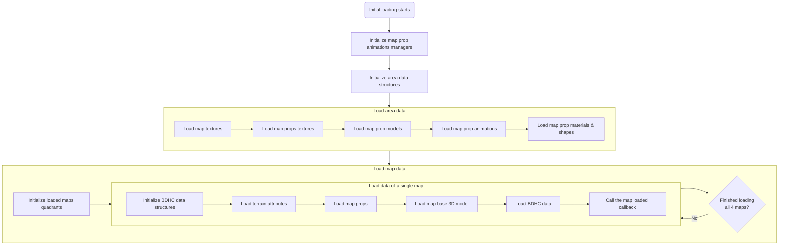

# Map loading

This document aims to provide an overview of how the maps are loaded during the
life cycle of the game.

## Introduction and initial loading

There are two concepts that are fundamental to understand how maps are loaded:

- the "_loaded maps quadrants_"
- the "_current map quadrants_"

The loaded maps quadrants are a 2x2 grid of maps that are currently loaded in
memory. Those 4 maps are the maximum number of maps that can be loaded at any
given time. If more maps are needed (from a map design perspective), then the
game either uses warps (common in buildings to switch between floors) or lazy
loading (the overworld and underground, for instance) if seamless transitions
are needed.

The current map quadrants are simply a division of the map the player is currently
in, into 4 quadrants. This is used to determine which maps to lazy load when the
player moves around.

One interesting property of both quadrants is that they are related: the current
map quadrant the player is in is always the opposite of the loaded maps quadrant
the player is in.

For instance, if the player is standing in the top-left quadrant of the current
map, this means that they are standing in the bottom-right quadrant of the loaded
maps quadrants.

In other words, this means that the maps loaded will be the map above the player,
on the left of the player, and the map on the top-left of the player.

Here's an illustration of this:

Here:

- Dawn represents the player
- The black squares represent a 3x3 map matrix
- The orange dotted line represent the loaded maps quadrants when the player is
  in the top-left quadrant of the current map
- The blue dotted line represent the loaded maps quadrants when the player is
  in the top-right quadrant of the current map
- The red dotted line represent the loaded maps quadrants when the player is
  in the bottom-left quadrant of the current map
- The green dotted line represent the loaded maps quadrants when the player is
  in the bottom-right quadrant of the current map
- The central map, where Dawn is standing, is the current map
- The current map quadrants can be imagined on the current map using the dotted
  lines

The map matrix is the data structure that contains the grid used to determine
which map (more precisely, which map header and map data) to load at a certain
location.

The game engine makes a distinction between two types of map loading: the first
one is what is called initial loading, which is when the game loads all 4 maps
and the entirety of their related data in other maps subsystems. This kind of
load happens when the player loads a save file, or when the player takes a warp
for instance.

Here's a flow chart that provides an overview of initial loading:

The other one is lazy loading, which is addressed in the next section.

## Lazy loading

Lazy loading is a lighter version of loading a map. For instance, it does not
load any new area data, which is why sometimes, the player must go through a gate
to force a warp and trigger an initial loading.

The game engine is flexible enough to allow tracking any map object and lazy load
maps according to its position, but most of the time the map object that is tracked
is the player. Therefore, this document assumes that the player is the map object
being tracked.

Due to how this system is designed, maps are always lazy loaded in pairs. This is
better explained with the example animations present at the end of this document.

Behind the scenes, the game has 2 separate queues for lazy loading maps, and a
space to store one extra lazy load request. This extra lazy load request overrides
one of the two queues (when the other one has finished working), and is likely
there to help in situations where the player is moving quickly between maps.
In practice, this system seems to misbehave under pressure, as the Tweaking
glitch demonstrates.

Those queues are processed sequentially and asynchronously, which gives the player
the illusion that the map is actually one single big playground.

Here's a flow chart that provides an overview of lazy loading:

```mermaid
flowchart TD
    start(Lazy loading starts)

    load_terrain_attributes[Load terrain attributes]
    load_map_props[Load map props]
    start_lazy_load_map_model[Start lazy loading the map base 3D model]
    start_lazy_load_bdhc[Start lazy loading the BDHC data]

    cancel_lazy_loading_map_model_bdhc_requested@{ shape: diamond, label: "Has cancelling lazy loading been requested?" }
    cancel_lazy_loading_map_model_bdhc[Cancel lazy loaders]
    lazy_loading_map_model_bdhc_finished@{ shape: diamond, label: "Has map base 3D model and BDHC data finished lazy loading?" }
    wait_lazy_loading_map_model_bdhc_finished[Wait for both lazy loaders]
    call_map_loaded_callback[Call the map loaded callback]

    start --> land_data_lazy_loader_task

    subgraph land_data_lazy_loader_task[Map data lazy loader task]
        subgraph land_data_lazy_loader_load_map_subtask[Load maps sub-task]
            direction LR

            load_terrain_attributes --> load_map_props
            load_map_props --> start_lazy_load_map_model
            start_lazy_load_map_model --> start_lazy_load_bdhc
        end

        land_data_lazy_loader_load_map_subtask --> land_data_lazy_loader_finish_map_load_subtask

        subgraph land_data_lazy_loader_finish_map_load_subtask[Finish loading maps sub-task]
            direction LR

            cancel_lazy_loading_map_model_bdhc_requested -->|No| lazy_loading_map_model_bdhc_finished
            cancel_lazy_loading_map_model_bdhc_requested -->|Yes| cancel_lazy_loading_map_model_bdhc
            cancel_lazy_loading_map_model_bdhc --> lazy_loading_map_model_bdhc_finished
            lazy_loading_map_model_bdhc_finished -->|No| wait_lazy_loading_map_model_bdhc_finished
            wait_lazy_loading_map_model_bdhc_finished --> lazy_loading_map_model_bdhc_finished
            lazy_loading_map_model_bdhc_finished -->|Yes| call_map_loaded_callback
        end
    end
```

Below are four animations showing the player changing maps. The player is
represented by Dawn, and the maps are represented by the black squares.
The loaded maps are in green. The current map is split in four quadrants.

  
Player moving to the map on the top (click me)

https://github.com/user-attachments/assets/a27da2a2-f017-4133-bbf3-260cbd425baf

  
Player moving to the map on the right (click me)

https://github.com/user-attachments/assets/8ca91358-a0f0-46fc-8df5-aaea70b8cef9

  
Player moving to the map on the left (click me)

https://github.com/user-attachments/assets/795aa6b5-fff1-4717-b980-0c5b4fb9cf3f

  
Player moving to the map on the bottom (click me)

https://github.com/user-attachments/assets/6fe01327-d6f9-4f48-9f0b-c338655e759c

Below are four animations showing the player changing current map quadrants.
The player is represented by Dawn, and the maps are represented by the black
squares. The loaded maps are in green. The current map is split in four quadrants.
The maps being unloaded are in red, and the maps being loaded are in orange.

  
Player moving to the current map quadrant on the top (click me)

https://github.com/user-attachments/assets/9420b723-1b16-4ca7-954d-9eba4da3430e

  
Player moving to the current map quadrant on the right (click me)

https://github.com/user-attachments/assets/2205445f-e0bc-4e16-b507-5047c5548810

  
Player moving to the current map quadrant on the left (click me)

https://github.com/user-attachments/assets/15530353-b2be-43e1-9a16-7b2436990460

  
Player moving to the current map quadrant on the bottom (click me)

https://github.com/user-attachments/assets/13773394-ab72-4c0a-ae16-3e1f62c9a912

